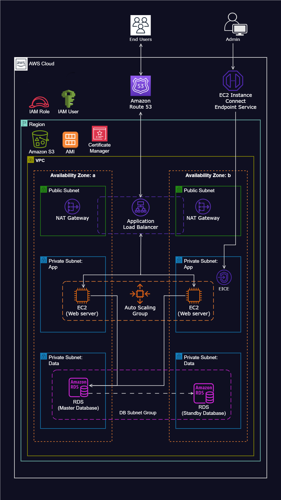

---

# Dynamic Website Deployment on AWS

## Project Overview
This project demonstrates the deployment of a dynamic website on AWS using various AWS services to ensure scalability, security, and high availability. The infrastructure is designed with a Virtual Private Cloud (VPC) spanning multiple Availability Zones, leveraging an Auto Scaling Group, Load Balancer, and other AWS services.

## Architecture Diagram
A reference architecture diagram and deployment scripts can be found in the project's [GitHub Repository](#) (replace with actual link).

## AWS Resources Utilized
### **Networking and Security**
1. **Virtual Private Cloud (VPC):** Configured with both public and private subnets across two Availability Zones.
2. **Internet Gateway:** Enables communication between VPC instances and the internet.
3. **Security Groups:** Serve as a network firewall mechanism to regulate inbound and outbound traffic.
4. **Availability Zones:** Two Availability Zones were used to ensure fault tolerance and reliability.
5. **Public Subnets:** Used for the Application Load Balancer (ALB) and NAT Gateway.
6. **EC2 Instance Connect Endpoint:** Enables secure connections to assets within both public and private subnets.
7. **Private Subnets:** Web servers (EC2 instances) are placed in private subnets for enhanced security.
8. **NAT Gateway:** Allows instances in private subnets to access the internet while remaining secure.

### **Compute and Scalability**
9. **EC2 Instances:** Hosted the dynamic website.
10. **Application Load Balancer (ALB):** Distributes incoming traffic across an Auto Scaling Group of EC2 instances.
11. **Auto Scaling Group:** Automatically manages EC2 instances to ensure availability, scalability, fault tolerance, and elasticity.

### **Security and Monitoring**
12. **AWS Certificate Manager (ACM):** Secures application communications with SSL/TLS certificates.
13. **Simple Notification Service (SNS):** Configured to send notifications regarding Auto Scaling activities.

### **Domain and Storage**
14. **Route 53:** Domain name registration and DNS configuration for routing web traffic.
15. **Amazon S3:** Used to store application code.

## Deployment Instructions
1. Clone the GitHub repository:
   ```sh
   git clone <repository-url>
   cd <project-directory>
   ```
2. Deploy the CloudFormation template or Terraform scripts (if provided) to set up the infrastructure.
3. Configure DNS settings in Route 53 to point to the ALB.
4. Upload the application code to S3 and deploy it to EC2 instances.
5. Validate the deployment by accessing the website using the registered domain name.

## Monitoring and Alerts
- The Auto Scaling Group is configured with SNS to send notifications on instance scaling events.
- AWS CloudWatch can be used for monitoring instance performance and logging application errors.

## Conclusion
This project demonstrates a highly available, scalable, and secure architecture for hosting a dynamic website on AWS using best DevOps practices. By leveraging AWS services, we ensure seamless scalability, security, and efficient resource management.

---


